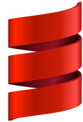
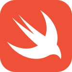
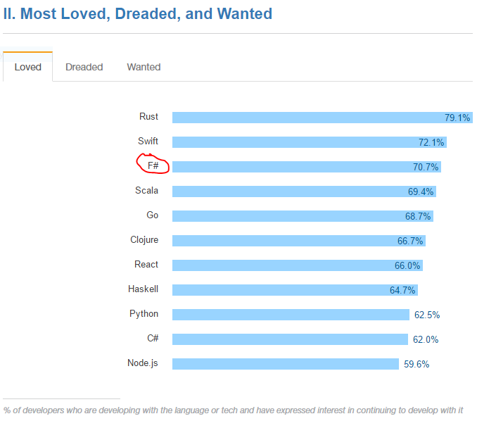
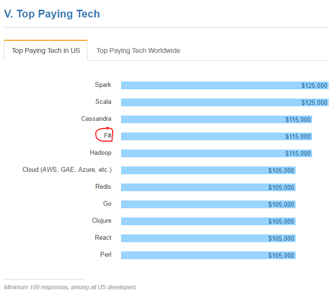
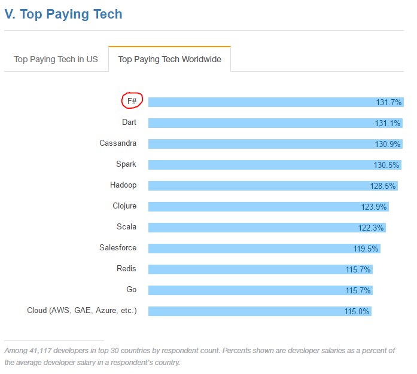

- title : F# Functional Programming
- description : Introduction to Functional Programming in F# context
- author : Michał Grygierzec
- theme : white
- transition : concave
- slideNumber : true

***
- data-background : images/fsharp2048.png
- data-background-repeat : no-repeat
- data-background-size : contain
- class : title-logo

# F# Functional Programming
##### Michał Grygierzec

' -	Are you using FP paradigm in whatever language already?
' -	Have you heard about F# already?
' -	Have you used it?
' And the very last question:
' -	How many .NET developers do we have here?

***
- data-background : images/fsharp2048.png
- data-background-repeat : no-repeat
- data-background-size : contain
- class : title-logo-fout

## Agenda

1. FP in Software Industry
2. History
3. Motivation
4. Concepts
5. Insights
6. Demo

' 1. FP in Software Industry
' 2. Brief FP and F# history
' 3. My Motivation for learning new paradigm and language
' 4. FP concepts in F# context
' 5. Interesting statistics revealed
' 6. Demo

***
- data-background : images/fsharp2048.png
- data-background-repeat : no-repeat
- data-background-size : contain
- class : title-logo-fout software-industry

### Functional Programming in software Industry

*  [F#](http://fsharp.org/) 
*  [Scala](http://www.scala-lang.org/) 
*  [Swift](https://swift.org/)

*  [Haskell](https://haskell-lang.org/)
*  [Erlang](https://www.erlang.org/)
*  [Clojure](https://clojure.org/)

*  [Elixir](http://elixir-lang.org/) 
*  [JS](https://www.javascript.com) 
*  [Elm](http://elm-lang.org/)

***
- data-background : images/fsharp2048.png
- data-background-repeat : no-repeat
- data-background-size : contain
- class : title-logo-fout

### Functional Programming History

* 1950s - Lisp by John McCarthy (MIT)
* 1960s - APL by Kenneth E. Iverson (Harvard)
* 1970s - ML by Robin Milner (University of Edinburgh)
* 1986 - Erlang 
* 1990 - Haskell 
* 1996 - OCaml 
* 2004 - Scala 
* **2005 - F# by Don Syme**  <!-- .element: class="fsharp" --> 
* 2007 - Clojure 
* 2012 - **Elm**
* 2014 - Swift 

' - 1972 C
' - 1983 C++
' - 1994 Java
' - 2000 C#

---
- data-background : images/fsharp2048.png
- data-background-repeat : no-repeat
- data-background-size : contain
- class : title-logo-fout

### F# History

* 2005 - first stable release (F# 1.0)
* Don Syme - language designer
* Open Source (since **2010**)
* Cross-platform
* [fsharp.org](http://fsharp.org/) - F# official page

***
- data-background : images/fsharp2048.png
- data-background-repeat : no-repeat
- data-background-size : contain
- class : title-logo-fout

### My Motivation

* Broaden horizons
* Productivity
* Safety
* Reliability
* Robustness
* Joy
* Peace

' ...
' -	have fun doing this
' -	and do not worry about runtime exceptions or strange errors at all 

---
- data-background : images/fsharp2048.png
- data-background-repeat : no-repeat
- data-background-size : contain
- class : title-logo-fout

> **Alan Perlis**: a language that doesn't affect the way you think about programming, is not worth knowing.

' - famous, American computer scientist
' - first recepient of Turing Award
' - years of work in imperative and OO prog.
' - I discovered FP
' - eye-opener

***
- data-background : images/fsharp2048.png
- data-background-repeat : no-repeat
- data-background-size : contain
- class : title-logo-fout

### F# Overview

* Functional
* Imperative
* Object-Oriented
* Asynchronous
* Parallel
* Agent model

' MARKER 3:35
' Swiss Army knife in MacGyver’s pocket

***
- data-background : images/fsharp2048.png
- data-background-repeat : no-repeat
- data-background-size : contain
- class : title-logo-fout

### Type inference

A mechanism used by compiler to deduce what types are used in expressions in a program.

' What does it mean in practice?
' Less typing!

---
- data-background : images/fsharp2048.png
- data-background-repeat : no-repeat
- data-background-size : contain
- class : title-logo-fout

### Type inference

    let num = 7
    let str = "F# rocks!"
    let pi = 3.14

    let circleArea r = 3.14 * r ** 2.
    circleArea 1.

' - computers - do our work
' - no type annotations
' - info in tooltips

---
- data-background : images/fsharp2048.png
- data-background-repeat : no-repeat
- data-background-size : contain
- class : title-logo-fout

### Type inference - explicit annotations

    open System
    let getTomorrow (today: DateTime) =
        today.AddDays(1.)
    let tomorrow = getTomorrow DateTime.UtcNow

' - OO often breaks type inference

***
- data-background : images/fsharp2048.png
- data-background-repeat : no-repeat
- data-background-size : contain
- class : title-logo-fout

### Immutability

* no side-effects
* no mutation of a state
* no modifications of other parts of a program

' - once defined binding cannot change
' - priceless, dead sure predictability 
' - life easier
' - mental shift

---
- data-background : images/fsharp2048.png
- data-background-repeat : no-repeat
- data-background-size : contain
- class : title-logo-fout

### Immutability

    let x = 7
    // x = x + 1 // WRONG!!
    let y = x + 1 // GOOD

' - 7 bound to x identifier
' - after transform only bind to new iden.
' - x cannot be changed

***
- data-background : images/fsharp2048.png
- data-background-repeat : no-repeat
- data-background-size : contain
- class : title-logo-fout

### Currying

... means **transforming** a function with many arguments, 

into a **series** of functions,

each with **only one argument**.

All functions in F# are auto-curried by compiler.

---
- data-background : images/fsharp2048.png
- data-background-repeat : no-repeat
- data-background-size : contain
- class : title-logo-fout

### Currying

    let add x y = x + y

    let add' x = fun y -> x + y

    let add'' =
        fun x ->
            fun y -> 
                x + y

' - given add fn
' - rewrite using lambda expression
' - transform further - nested
' - ...
' - reflected in type signatures

***
- data-background : images/fsharp2048.png
- data-background-repeat : no-repeat
- data-background-size : contain
- class : title-logo-fout

### Partial Application

... means passing to function **less arguments** 

than it **originally** accepts. 

As a result function **returns another function**, 

which **accepts remaining** parameters.

' - why the heck should I use it?
' - analyze toy example

---
- data-background : images/fsharp2048.png
- data-background-repeat : no-repeat
- data-background-size : contain
- class : title-logo-fout

### Partial Application

    let add x y = x + y

    let increment = add 1

    increment 3 // 4

' - line 3 - fn partially applied
' - new fn - specific meaning
' - write less code
' - reuse in new contexts

***
- data-background : images/fsharp2048.png
- data-background-repeat : no-repeat
- data-background-size : contain
- class : title-logo-fout

### Higher Order Functions

Functions which:

**accept** another function as an **input**,

or **return** function as an **output**.

' - fairly simple, yet powerful

---
- data-background : images/fsharp2048.png
- data-background-repeat : no-repeat
- data-background-size : contain
- class : title-logo-fout

### Higher Order Functions

    let calculate f x y =
        f x y

    calculate (+) 3 4

    calculate (*) 3 4

' - encourages DRY
' Don't repeat yourself

***
- data-background : images/fsharp2048.png
- data-background-repeat : no-repeat
- data-background-size : contain
- class : title-logo-fout

## Pattern Matching

' - powerful
' - used in many FP langs
' - adoption
' - JS ES6 - destructuring

---
- data-background : images/fsharp2048.png
- data-background-repeat : no-repeat
- data-background-size : contain
- class : title-logo-fout

### Pattern Matching I

    let x, _, z = (1, 3, 5)
    printfn "x: %i; z: %i" x z

---
- data-background : images/fsharp2048.png
- data-background-repeat : no-repeat
- data-background-size : contain
- class : title-logo-fout

### Pattern Matching II

    let a::b::rest = [1..10] 
    printfn "a: %i; b: %i; rest: %A" a b rest

---
- data-background : images/fsharp2048.png
- data-background-repeat : no-repeat
- data-background-size : contain
- class : title-logo-fout

### Pattern Matching III

    let aList = []
    match aList with
    | [] -> printfn "empty" 
    | [x] -> printfn "one item: %A" x 
    | [x; y] -> printfn "two items: %A and %A" x y 
    | _ -> printfn "many items"

' - you can create any set of patterns
' - compiler will warn you when pattern missing

***
- data-background : images/fsharp2048.png
- data-background-repeat : no-repeat
- data-background-size : contain
- class : title-logo-fout

### Structure Equality

    4 = 3 // false

    let field1 = ("a", 3)
    let field2 = ("a", 5 - 2)
    field1 = field2 // true

    type Person = { Name: string; Age: int }
    let m1 = { Name = "Mike"; Age = 22 }
    let m2 = { Name = "Mike"; Age = 22 }
    m1 = m2 // true

' compare complex values - records

***
- data-background : images/fsharp2048.png
- data-background-repeat : no-repeat
- data-background-size : contain
- class : title-logo-fout

### Option Type

It is a union of two cases:

* Data is **present**
* Data is **missing**

' - in every FP lang
' - built into the F#
' - union of 2, either
' - have data
' - or have nothing

---
- data-background : images/fsharp2048.png
- data-background-repeat : no-repeat
- data-background-size : contain
- class : title-logo-fout

### Option Type

    type Option<'a> =
    | Some of 'a
    | None  

' - discriminated union
' - None and Some cases
' - please note a generic type 'a for Some case

---
- data-background : images/fsharp2048.png
- data-background-repeat : no-repeat
- data-background-size : contain
- class : title-logo-fout

### Option Type

    let x = Some 5
    let result = match x with 
    | Some i -> Some (i * 2)
    | None -> None

' - use of option with pattern matching

***
- data-background : images/fsharp2048.png
- data-background-repeat : no-repeat
- data-background-size : contain
- class : title-logo-fout statistics

### F# Vital Statistics

[Developer Survey Results 2016](http://stackoverflow.com/research/developer-survey-2016) 

by

' MARKER 10:00

---
- data-background : images/fsharp2048.png
- data-background-repeat : no-repeat
- data-background-size : contain
- class : title-logo-fout

#### F# Vital Statistics - Most Loved

---
- data-background : images/fsharp2048.png
- data-background-repeat : no-repeat
- data-background-size : contain
- class : title-logo-fout

#### F# Vital Statistics - Top Paying Tech US

---
- data-background : images/fsharp2048.png
- data-background-repeat : no-repeat
- data-background-size : contain
- class : title-logo-fout

#### F# Vital Statistics - Top Paying Tech Worldwide

***
- data-background : images/fsharp2048.png
- data-background-repeat : no-repeat
- data-background-size : contain
- class : title-logo-fout

### Resources

* [http://fsharp.org](http://fsharp.org/) - official site
* [http://fsharpforfunandprofit.com](http://fsharpforfunandprofit.com/) - F# for Fun and Profit by S. Wlaschin
* [https://sergeytihon.wordpress.com](https://sergeytihon.wordpress.com/) - F# Weekly
* [http://tomasp.net](http://tomasp.net/) - Tomas Petricek blog
* [http://evelinag.com](http://evelinag.com/) - Evelina Gabasova blog (ML)
* [http://mbrace.io](http://mbrace.io) - Cloud Computing
* [http://fslab.org](http://fslab.org) - Machine Learning

' - spark in your eyes
' - recommend wholeheartedly
' - famous blog
' - the best blog ever

***
- data-background : images/fsharp2048.png
- data-background-repeat : no-repeat
- data-background-size : contain
- class : title-logo-fout

### Summary - F#

* multi-paradigm (FP, OO)
* flexible
* powerful
* functional-first

---
- data-background : images/fsharp2048.png
- data-background-repeat : no-repeat
- data-background-size : contain
- class : title-logo-fout

### Summary - F# code

* concise
* clean
* robust
* safe
* expressive
* reusable
* maintainable

' - Thanks to functional concepts and language features
' - achieve more writing less
' - coudebase pleasure to maintain

---
- data-background : images/fsharp2048.png
- data-background-repeat : no-repeat
- data-background-size : contain
- class : title-logo-fout

### F# Developer

' - hunt out the joy of programming
' - exactly I found
' - wish you all the best with FP in F#

***
- data-background : images/fsharp2048.png
- data-background-repeat : no-repeat
- data-background-size : contain
- class : title-logo-fout

## Demo

' - recorded small demo
' - topic of F# workshops tomorrow
' - web app; entirely in F#

---
- data-background-video : images/demo.webm
- class : title-logo-fout demo

' - firstly builds server
' - client
' - fable compiler 
' - output is JS 
' - wepack bundles React.js app

***
- data-background : images/fsharp2048.png
- data-background-repeat : no-repeat
- data-background-size : contain
- class : title-logo-fout

## Thank you!

[@FSharpWalker](https://twitter.com/FSharpWalker)

' - huge thank you to my wife
' - patience, support, finish on time
' - thanking you all 
' - presentation in F#
' - Qs in lounge

